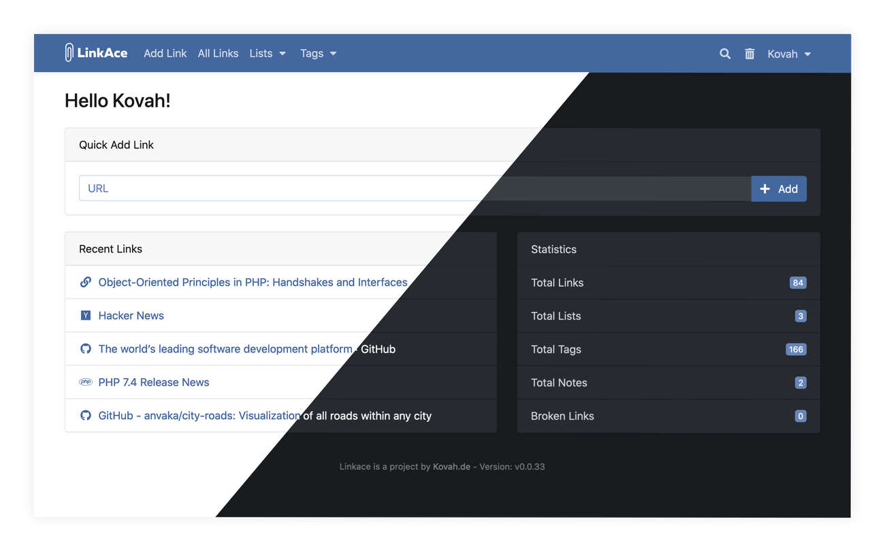

# LinkAce
- Decent UI with light & dark themes (but not without issues & FOUCs)
- UX is a bit odd at times and not very intuitive (e.g. Clicking on a link name will open the link in one place, but in another it will open the link-ace entry)
- Imports only from `bookmarks.html` exported from a browser (and it looks like it's crashing at the end, as you need to manually refresh the page)
- Auto-tags bookmarks on import
- No bulk actions (e.g. cannot tag/untag 10 items at once)
- Search is not quick & easy to use and filters are odd:
  - e.g. you can filter for "Private links only" but not for "Public links only"
  - you can uncheck "title" and "description" and it will still find stuff

- [Github repo](https://github.com/Kovah/LinkAce/)
- [Docs](https://www.linkace.org/docs)



## Important step!
After `docker-compose up -d` you need to run a few commands:
```sh
# generate app key
docker exec linkace_app_1 php artisan key:generate
# set permissions
chmod 777 .env
sudo chmod -R 777 logs
```

## .env
```ini
# The application name is used internally and may not be changed
APP_NAME=LinkAce
COMPOSE_PROJECT_NAME=linkace
APP_URL=http://192.168.1.10
APP_ENV=production
APP_DEBUG=false
SETUP_COMPLETED=false

# The app key is generated later, please leave it blank
APP_KEY=
# Set to true, if you are using a proxy that terminates SSL. Required to get the correct URLs for LinkAce
FORCE_HTTPS=false
# session expiration in minutes. Default is 7 days.
SESSION_LIFETIME=10080

BACKUP_ENABLED=false
BACKUP_DISK=local
BACKUP_MAX_SIZE=512

## If you are using the standard configuration provided by LinkAce, you can leave all values except the password as they are. Docker will automatically create a linkace database and a corresponding user.
DB_CONNECTION=mysql
DB_HOST=db
DB_PORT=3306
DB_DATABASE=linkace
# Even if you use the standard configuration, please set a secure password here.
DB_USERNAME=linkace
DB_PASSWORD=ChangeThisToASecurePassword!

## Redis cache configuration
# REDIS_HOST=redis
# REDIS_PASSWORD=ChangeThisToASecurePassword!
# REDIS_PORT=6379

## You probably do not want to change any values blow. Only continue if you know what you are doing.
SESSION_DRIVER=file
LOG_CHANNEL=stack
BROADCAST_DRIVER=log
CACHE_DRIVER=file
QUEUE_DRIVER=database
```

## docker-compose.yml
```yml
---
services:
  db:
    image: mariadb:10.5
    restart: unless-stopped
    command: mysqld --character-set-server=utf8mb4 --collation-server=utf8mb4_bin
    environment:
      - MYSQL_ROOT_PASSWORD=${DB_PASSWORD}
      - MYSQL_USER=${DB_USERNAME}
      - MYSQL_PASSWORD=${DB_PASSWORD}
      - MYSQL_DATABASE=${DB_DATABASE}
    volumes:
      - ./db:/var/lib/mysql

  app:
    image: linkace/linkace:simple
    restart: unless-stopped
    depends_on:
      - db
    ports:
      - "3123:80"
    volumes:
      - ./.env:/app/.env
      - ./logs:/app/storage/logs
      - ./backups:/app/storage/app/backups
```
