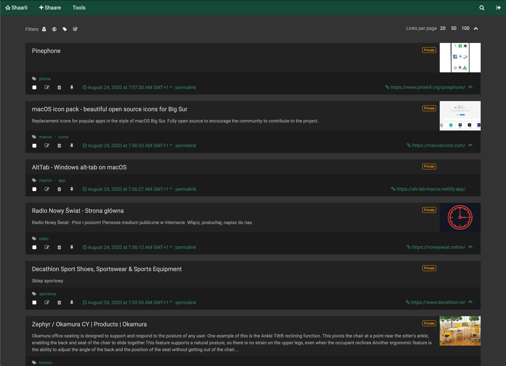

# Shaarli
Not too bad. Just stores & tags links, nothing more.
- [Github repo](https://github.com/shaarli/Shaarli)
- [Docs](https://shaarli.readthedocs.io/en/master/)
- [Demo](https://demo.shaarli.org/)




## docker-compose.yml
```yml
---
version: '3'
services:
  shaarli:
    image: shaarli/shaarli:master
    container_name: shaarli
    restart: unless-stopped
    environment:
      - TZ=Europe/Dublin
    ports:
      - "3123:80"
    volumes:
      - ./cache:/var/www/shaarli/cache
      - ./data:/var/www/shaarli/data
```

## Tips & Tricks

### Nicer theme
Edit `shaarli/data/user.css`:
```css
:root {
    --main-color: #144837;
    --background-color: #333;
    --dark-main-color: #0c281d;
}

#actions,
#search { display: none; position: relative; }
#actions.open,
#search.open { display: block; }

#shaarli-menu-tags,
#shaarli-menu-picwall,
#shaarli-menu-daily,
#shaarli-menu-desktop-rss,
#linklist-paging-bottom-block,
#footer,
.linksperpage form,
.linkcount,
.fa-external-link,
.pure-u-lg-2-24,
#search-linklist .searchform { display: none !important; }

#link-count-content,
#linklist-loop-content { width: 90%; margin: 10px auto; }

#linklist { margin-bottom: 40px; }

.linklist-item-title,
.linklist-item { background-color: #222; color: #f0f0f0; }

.linklist-item { margin-bottom: 20px; }

.linklist-item-title .linklist-link { color: #ccc !important; font-weight: 300; }

.linklist-item-infos { background: #0003; color: #333; }

.linklist-filters,
.linksperpage,
.linklist-item-description,
.linklist-item-infos { color: #aaa !important; }

.linklist-item.private::before { display: none; }
.linklist-item { box-shadow: none; }

.linksperpage a,
.linklist-filters .filter-off { background: none; color: #eee; }

.linklist-item-infos { padding: 10px 20px; }
.linklist-item-infos a { color: #317b63; }
.linklist-item-infos a:hover { color: #eee; }

.label { font-weight: 300; }
.markdown { font-size: 14px; }

.linklist-item-title { padding: 5px 10px; }
.linklist-item-description { padding: 5px 20px; }
.linklist-item-thumbnail { margin: -5px -10px 0 0; }


.linklist-item-infos-dateblock { display: flex; align-items: center; }
.linklist-item-infos-controls-group { display: inline-flex !important; align-items: center; border-right: 0; }
.linklist-item-infos-controls-item {
    height: 24px;
    display: inline-flex;
    align-items: center;
    justify-content: flex-start;
    width: 32px;
}
.linklist-item-infos-url { font-size: 14.4px; }
.linklist-item-editbuttons { position: absolute; right: 130px; }

.page-form,
.page-form .window-title,
.page-form { background: #222; color: #eee; box-shadow: none; }

.page-form-complete div,
.page-form-complete p { color: #eee; }

.page-form input[type="password"],
.page-form input[type="text"],
.page-form textarea { background: #111; color: #eee; border-color: #111; }

.page-form a.button,
.page-form input[type="submit"] { box-shadow: none; border-radius: 5px; }

.pure-button {
   background-color: #111;
   color: #ccc;
   border-radius: 5px;
   padding: 12px;
   font-weight: 300;
}

.linklist-item-tags { margin-bottom: 5px; }

.edit-link,
.delete-link,
.pin-link { font-size: 14px !important; }

.linklist-item-infos .pin-link,
.edit-link,
.delete-link { color: #ccc !important; }
```
