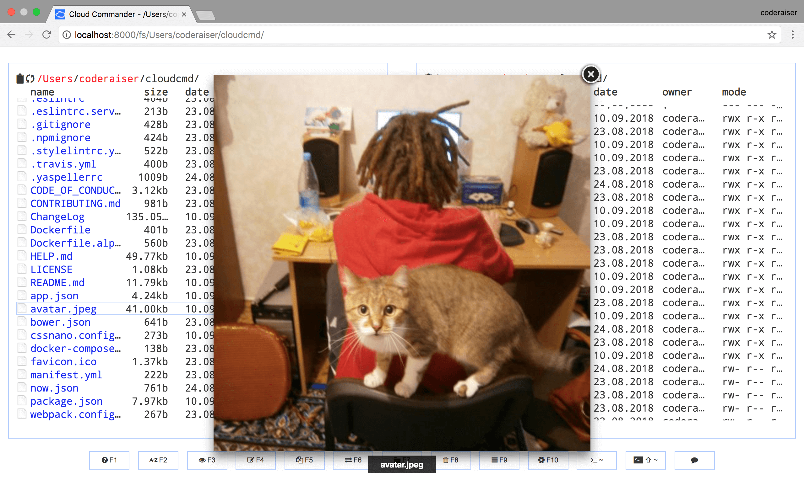

# CloudCmd

- Fantastic web file manager with console and editor!
- Dual-panel interface.
- Easy to use and configure.


<br>

- [Homepage](https://cloudcmd.io/)
- [Github repo](https://github.com/coderaiser/cloudcmd)





## docker-compose.yml
```yaml
services:
  web:
    image: coderaiser/cloudcmd
    container_name: cloudcmd
    environment:
      - CLOUDCMD_CONTACT=false
      - CLOUDCMD_COLUMNS=name-size
      - CLOUDCMD_AUTH=true
      - CLOUDCMD_USERNAME=admin
      - CLOUDCMD_PASSWORD=admin
      - CLOUDCMD_ROOT=/mnt
    ports:
      - 8000:8000
    volumes:
      - /local_path:/mnt
```
