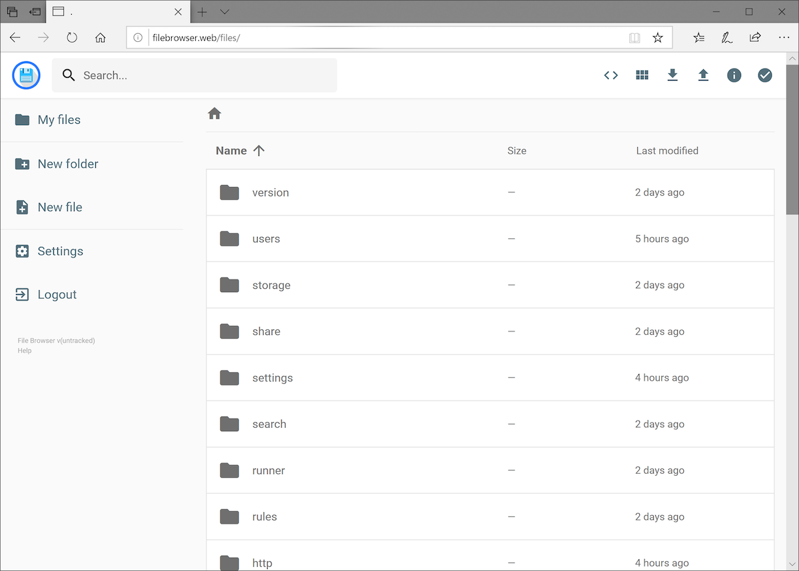

# Filebrowser

- nice dark theme
- it was difficult to setup (docs are not clear for a typical docker-compose setup)

<br>

- [Homepage/Docs](https://filebrowser.org)
- [Github repo](https://github.com/filebrowser/filebrowser)





## Prerequisites

There are 2 files required (which are expected, but not created automatically). We need to create them first:

```sh
touch filebrowser.json
touch filebrowser.db
```

The db file can remain empty (will be used by the app), the config - we need to update with some defaults:

## filebrowser.json
```json
{
  "port": 80,
  "baseURL": "/",
  "address": "0.0.0.0",
  "log": "stdout",
  "database": "/filebrowser.db",
  "root": "/srv"
}
```

## docker-compose.yml
```yaml
---
services:
  filebrowser:
    image: filebrowser/filebrowser
    container_name: filebrowser
    restart: unless-stopped
    user: "1000:1000"
    environment:
      - TZ=Europe/Dublin
    ports:
      - "3000:80"
    volumes:
      - ./filebrowser.db:/filebrowser.db
      - ./filebrowser.json:/.filebrowser.json
      - ./files/:/srv/

```

App should now be available at: `<server IP>:3000`
Login using:
- u: admin
- p: admin
