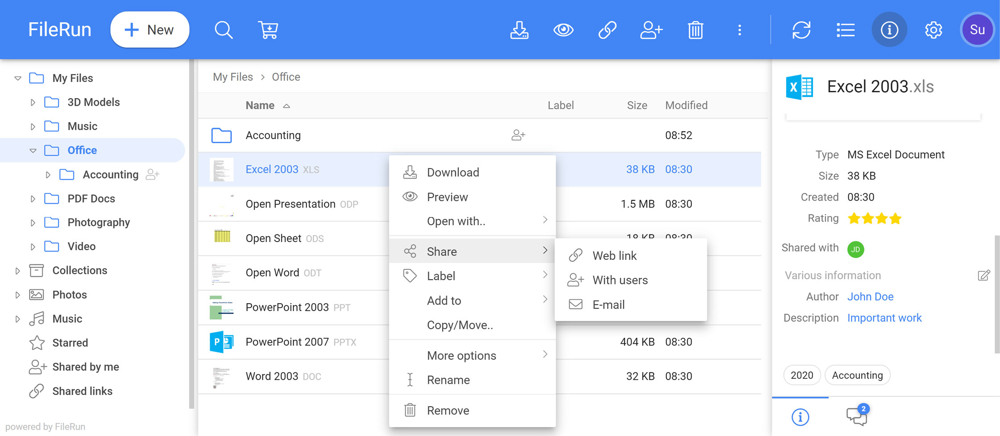

# FileRun
- Mobile apps are just webdav clients.
- Nice dark theme.
- Doesn't seem to support heic files out-of-the-box nicely
- Sharing as "image gallery" doesn't display videos (only their img thumbs)
- Sharing as "grid" doesn't allow for the nice gallery navigation

<br>

- [Homepage](https://filerun.com/)
- [DockerHub repo](https://hub.docker.com/r/afian/filerun/)
- [Docs](https://docs.filerun.com/)
- [Demo](https://demo.filerun.co/?username=admin&password=admin)




## docker-compose.yml
```yml
version: '2'
services:
  db:
    image: mariadb:10.1
    container_name: filerun-db
    restart: unless-stopped
    environment:
      MYSQL_ROOT_PASSWORD: your_mysql_root_password
      MYSQL_USER: db_user
      MYSQL_PASSWORD: db_user_password_01
      MYSQL_DATABASE: filerundb
    volumes:
      - ./data/db:/var/lib/mysql

  web:
    image: afian/filerun
    container_name: filerun
    restart: unless-stopped
    environment:
      FR_DB_HOST: db
      FR_DB_PORT: 3306
      FR_DB_NAME: filerundb
      FR_DB_USER: db_user
      FR_DB_PASS: db_user_password_01
      APACHE_RUN_USER: www-data
      APACHE_RUN_USER_ID: 33
      APACHE_RUN_GROUP: www-data
      APACHE_RUN_GROUP_ID: 33
    depends_on:
      - db
    links:
      - db:db
    ports:
      - "3090:80"
    volumes:
      - ./data/html:/var/www/html
      - ./data/user-files:/user-files
```

## Running
Create the folders first:
```sh
mkdir /data /data/html /data/user-files
```

The default FileRun credentials are: superuser:superuser
