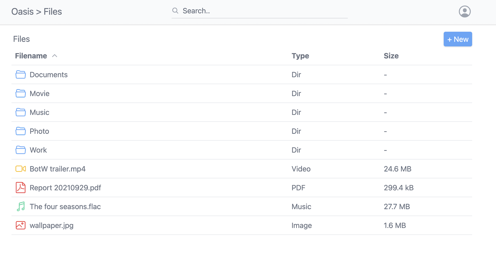

# Seafile

- UX needs work.
- Drag & drop upload doesn't work in Safari
- Extremely basic in functionality

<br>

- [Github repo](https://github.com/machengim/oasis)
- [DockerHub repo](https://hub.docker.com/r/machengim/oasis)





## docker-compose.yml
```yml
---
services:
  oasis:
    image: machengim/oasis
    container_name: oasis
    restart: unless-stopped
    environment:
      - TZ=Europe/Dublin
    ports:
      - "3123:8000"
    volumes:
      - ./data:/opt/oasis/data
      - ./storage:/home/storage
```
