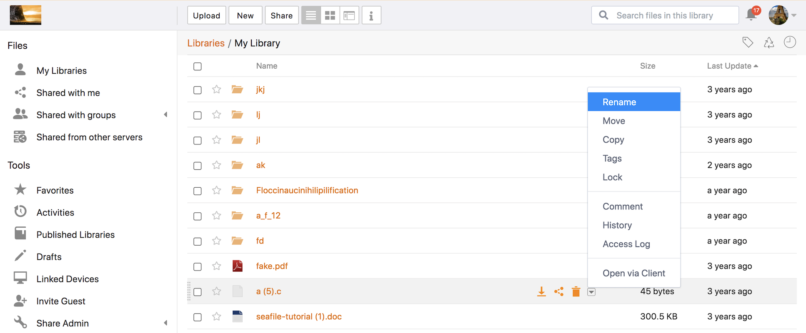

# Seafile
- Very simple, just raw files nothing more.
- Has mobile apps.

<br>

- [Homepage](https://www.seafile.com/en/home/)
- [Github repo](https://github.com/haiwen/seafile)
- [DockerHub repo](https://hub.docker.com/r/seafileltd/seafile-mc)
- [Docs](https://manual.seafile.com/docker/deploy_seafile_with_docker/)





## docker-compose.yml
Original file [here](https://download.seafile.com/d/320e8adf90fa43ad8fee/files/?p=/docker/docker-compose.yml).

```yml
---
services:
  db:
    image: mariadb:10.5
    container_name: seafile-mysql
    environment:
      - MYSQL_ROOT_PASSWORD=db_dev
      - MYSQL_LOG_CONSOLE=false
    volumes:
      - ./db:/var/lib/mysql

  memcached:
    image: memcached:1.6
    container_name: seafile-memcached
    entrypoint: memcached -m 256

  seafile:
    image: seafileltd/seafile-mc:latest
    container_name: seafile
    depends_on:
      - db
      - memcached
    environment:
      - DB_HOST=db
      - DB_USER=root
      - DB_ROOT_PASSWD=db_dev
      - TIME_ZONE=Europe/Dublin
      - SEAFILE_ADMIN_EMAIL=me@example.com
      - SEAFILE_ADMIN_PASSWORD=asecret
      - SEAFILE_SERVER_LETSENCRYPT=false
      - SEAFILE_SERVER_HOSTNAME=docs.seafile.com
    ports:
      - "3123:80"
    volumes:
      - ./data:/shared
```

**Important**: Variable `SEAFILE_SERVER_HOSTNAME` must be set for the file upload to work correctly.
If you're running it locally, set it to your server's IP:port, e.g. `192.168.1.123:3123`.


## Tips & tricks

### Dark theme

1. Copy the css from here: https://github.com/udlch/seafile_ce-edition_custom_theme/blob/master/sf_dark_theme_7.1.3.css
2. Check the box in: `System Admin / Settings / Use custom CSS`
3. Paste the css into the `Custom CSS` box
4. Save
