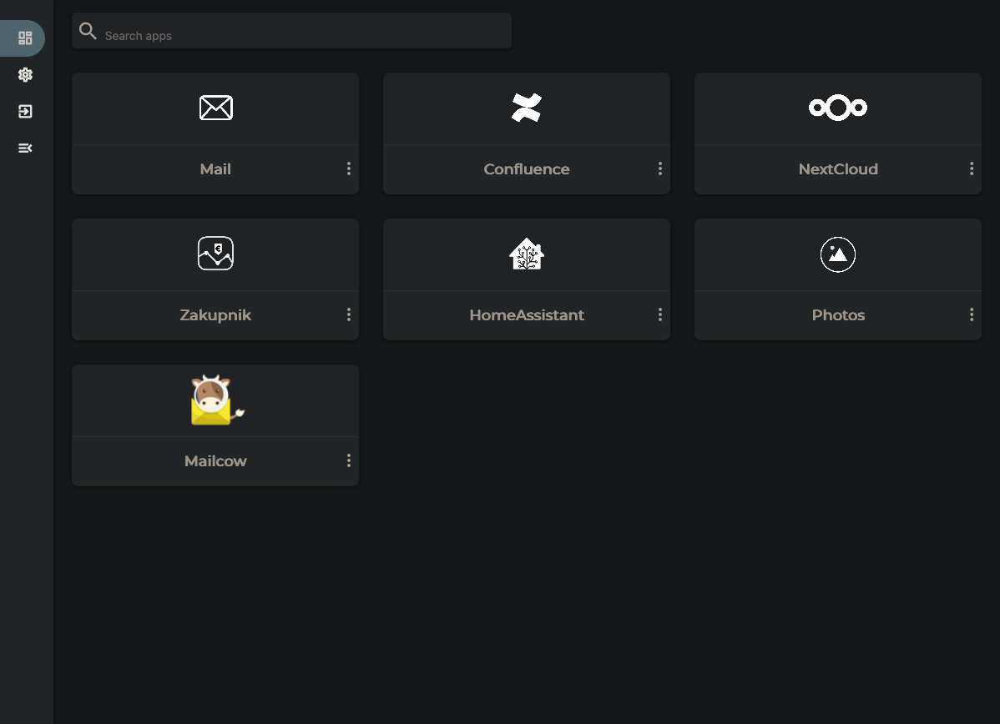

# DashMachine

- [Github repo](https://github.com/rmountjoy92/DashMachine)



- user roles are nice
- pretty monotonous and ugly - icons are huge and all look the same (no separation between apps & bookmarks, no sections)
- easy to start, difficult to setup (config is edited through the UI and in case of an error, you may loose the UI...)


## docker-compose.yml
```yml
version: '3.3'
services:
  dashmachine:
    image: rmountjoy/dashmachine:latest
    container_name: dashmachine
    restart: unless-stopped
    ports:
      - 4010:5000
    volumes:
      - ./data:/dashmachine/dashmachine/user_data
```
