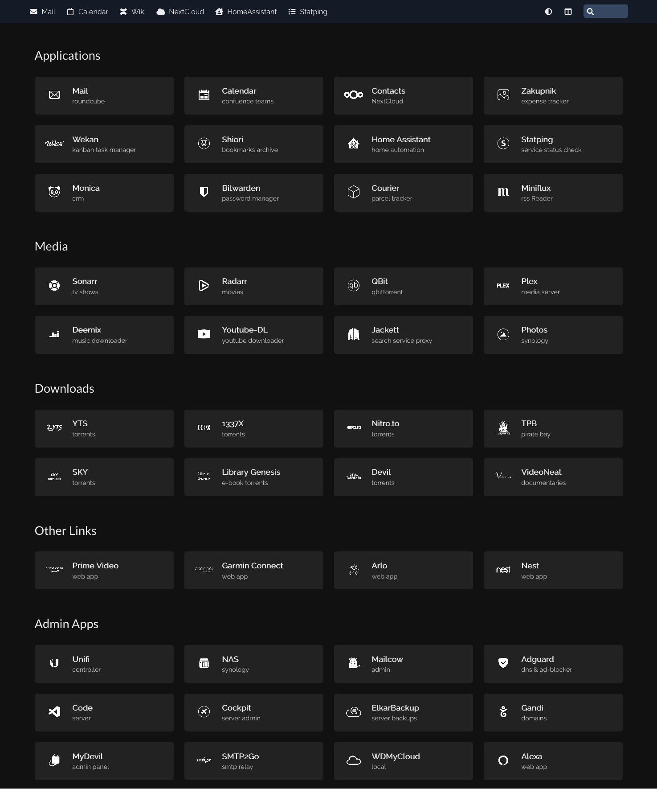

# Homer
- arduous configuration (with large number of apps)
- clear and pretty configurable
- nice features: filter, top links

<br>

- [Github repo](https://github.com/bastienwirtz/homer)
- [DockerHub repo]()




## docker-compose.yml
```yml
services:
  homer:
  image: b4bz/homer
  container_name: homer
  restart: unless-stopped
  ports:
    - 4020:8080
  volumes:
    - ./assets/:/www/assets
```

## config.yml
```yml
title: "Home"
subtitle: "start.example.com"
logo: false
header: false
footer: false
columns: "4"             # "auto" or number (must be a factor of 12: 1, 2, 3, 4, 6, 12)
connectivityCheck: true  # whether you want to display a message when the apps are not accessible anymore (VPN disconnected for example)

theme: default
colors:
  light:
    highlight-primary: "#3367d6"
    highlight-secondary: "#4285f4"
    highlight-hover: "#5a95f5"
    background: "#f5f5f5"
    card-background: "#ffffff"
    text: "#363636"
    text-header: "#ffffff"
    text-title: "#303030"
    text-subtitle: "#424242"
    card-shadow: rgba(0, 0, 0, 0.1)

  dark:
    highlight-primary: "#3367d6"
    highlight-secondary: "#141b27"
    highlight-hover: "#364762"
    background: "#111"
    card-background: "#222"
    text: "#eee"
    text-header: "#eee"
    text-title: "#eee"
    text-subtitle: "#ccc"
    card-shadow: none

stylesheet:
  - "assets/custom.css"

# Optional navbar
links:
  - name: "Mail"
    icon: "fas fa-envelope"
    url: "https://mail.example.com"

  - name: "Calendar"
    icon: "far fa-calendar"
    url: "https://calendar.example.com"

  - name: "NextCloud"
    icon: "fas fa-cloud"
    url: "https://cloud.example.com"

  - name: "HomeAssistant"
    icon: "fas fa-house-user"
    url: "https://home.example.com"


services:
  - name: "Applications"
    items:
      - name: "Mail"
        subtitle: "roundcube"
        logo: "assets/white/mailplus.png"
        url: "https://mail.example.com/roundcube"

      - name: "Calendar"
        subtitle: "confuence teams"
        logo: "assets/white/calendar.png"
        url: "https://calendar.example.com"

      - name: "Cloud"
        subtitle: "NextCloud"
        logo: "assets/white/nextcloud.png"
        url: "https://cloud.example.com"

      - name: "Wekan"
        subtitle: "kanban task manager"
        logo: "assets/white/wekan.png"
        url: "https://wekan.example.com"

      - name: "Home Assistant"
        subtitle: "home automation"
        logo: "assets/white/hass.png"
        url: "https://home.example.com"

      - name: "Monica"
        subtitle: "crm"
        logo: "assets/white/monicahq.png"
        url: "https://crm.example.com/"

      - name: "Bitwarden"
        subtitle: "password manager"
        logo: "assets/white/bitwarden.png"
        url: "https://bitwarden.example.com"

      - name: "Miniflux"
        subtitle: "rss Reader"
        logo: "assets/white/miniflux.png"
        url: "https://rss.example.com"


  - name: "Media"
    items:
      - name: "Sonarr"
        subtitle: "tv shows"
        logo: "assets/white/sonarr.png"
        url: "https://sonarr.example.com"

      - name: "Radarr"
        subtitle: "movies"
        logo: "assets/white/radarr.png"
        url: "https://radarr.example.com"

      - name: "QBit"
        subtitle: "qbittorrent"
        logo: "assets/white/qbittorrent.png"
        url: "https://qbit.example.com"

      - name: "Plex"
        subtitle: "media server"
        logo: "assets/white/plex.png"
        url: "https://plex.example.com"

      - name: "Deemix"
        subtitle: "music downloader"
        logo: "assets/white/deezer.png"
        url: "http://192.168.1.10:6595"

      - name: "Youtube-DL"
        subtitle: "youtube downloader"
        logo: "assets/white/youtube.png"
        url: "http://192.168.1.10:5000"

  - name: "Other Links"
    items:
      - name: "Prime Video"
        subtitle: "web app"
        logo: "assets/white/primevideo.png"
        url: "https://www.primevideo.com/"

      - name: "Garmin Connect"
        subtitle: "web app"
        logo: "assets/white/garmin connect.png"
        url: "https://connect.garmin.com/modern/"

      - name: "Arlo"
        subtitle: "web app"
        logo: "assets/white/arlo.png"
        url: "https://my.arlo.com/#/cameras"

      - name: "Nest"
        subtitle: "web app"
        logo: "assets/white/nest.png"
        url: "https://home.nest.com/home"


  - name: "Admin Apps"
    items:
      - name: "Unifi"
        subtitle: "controller"
        logo: "assets/white/ubiquiti.png"
        url: "https://unifi.example.com"

      - name: "NAS"
        subtitle: "synology"
        logo: "assets/white/nas-dark.png"
        url: "https://nas.example.com"

      - name: "Mailcow"
        subtitle: "admin"
        logo: "assets/white/mailcow.png"
        url: "https://mail.example.com"

      - name: "Adguard"
        subtitle: "dns & ad-blocker"
        logo: "assets/white/adguard.png"
        url: "https://ag.example.com"

      - name: "Code"
        subtitle: "server"
        logo: "assets/white/code-server.png"
        url: "https://code.example.com"

      - name: "Gandi"
        subtitle: "domains"
        logo: "assets/white/gandi.png"
        url: "https://id.gandi.net/en/login"

      - name: "SMTP2Go"
        subtitle: "smtp relay"
        logo: "assets/white/smtp2go.png"
        url: "https://app.smtp2go.com/dashboard/main/"

      - name: "Alexa"
        subtitle: "web app"
        logo: "assets/white/alexa.png"
        url: "https://alexa.amazon.co.uk/"
```
