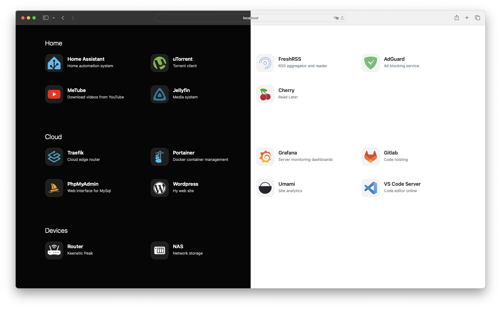

# Mafl

Minimalistic flexible homepage.

<br>

- [Github repo](https://github.com/hywax/mafl)
- [Website](https://mafl.hywax.space)




## docker-compose.yml
```yml

services:
  mafl:
    image: hywax/mafl
    restart: unless-stopped
    ports:
      - '3000:3000'
    volumes:
      - ./config.yml:/app/data/config.yml
```

## config.yml
```yml
title: My Home Page
services:
  Home:
    - title: Home Assistant
      description: Home automation system
      link: '#'
      icon:
        name: simple-icons:homeassistant
        wrap: true
        color: '#3dbcf3'
    - title: AdGuard
      description: Ad blocking service
      link: '#'
      icon:
        name: simple-icons:adguard
        wrap: true
        color: '#68bc71'

  Cloud:
    - title: Traefik
      description: Cloud edge router
      link: '#'
      icon:
        name: devicon:traefikproxy
        wrap: true
    - title: Portainer
      description: Docker container management
      link: '#'
      icon:
        name: devicon:portainer
        wrap: true
    - title: Grafana
      description: Server monitoring dashboards
      link: '#'
      icon:
        name: logos:grafana
        wrap: true

  Devices:
    - title: Router
      description: Keenetic Peak
      link: '#'
      icon:
        name: bi:router-fill
        wrap: true
    - title: NAS
      description: Network storage
      link: '#'
      icon:
        name: mdi:nas
        wrap: true
```
