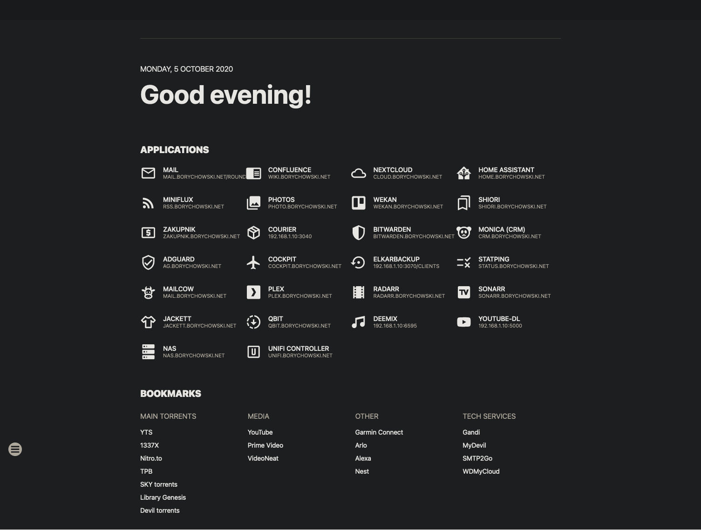

# SUI
- A bit of a pain to configure
- Couple of issues (submitted a PR)
- Looks pretty, has several themes
- Very simple and minimalistic

<br>

- [Github repo](https://github.com/jeroenpardon/sui/)





## docker-compose.yml
```yml
version: "3.5"
services:
  sui:
    container_name: sui
    restart: unless-stopped
    build:
      context: ./
    environment:
      - VIRTUAL_HOST=test.laserr.net
    ports:
      - 4000:80
    volumes:
      - ./:/opt/html
```

## apps.json
```json
{
    "apps" : [
        { "name":"App1", "url":"example.com", "icon":"email-outline" },
    ]
}
```


## links.json
```json
{
    "bookmarks": [
        {
            "category": "Media",
            "links": [
                { "name": "YouTube", "url": "https://youtube.com" },
                { "name": "Prime Video", "url": "https://www.primevideo.com/" },
                { "name": "VideoNeat", "url": "https://www.videoneat.com/category/documentaries/" }
            ]
        },
        {
            "category": "Other",
            "links": [
                { "name": "Garmin Connect", "url": "https://connect.garmin.com/modern/" },
                { "name": "Alexa", "url": "https://alexa.amazon.co.uk/" },
                { "name": "Nest", "url": "https://home.nest.com/home" }
            ]
        },
        {
            "category": "Tech Services",
            "links": [
                { "name": "Gandi", "url": "https://id.gandi.net/en/login" },
                { "name": "SMTP2Go", "url": "https://app.smtp2go.com/dashboard/main/" }
            ]
        }
    ]
}
```
