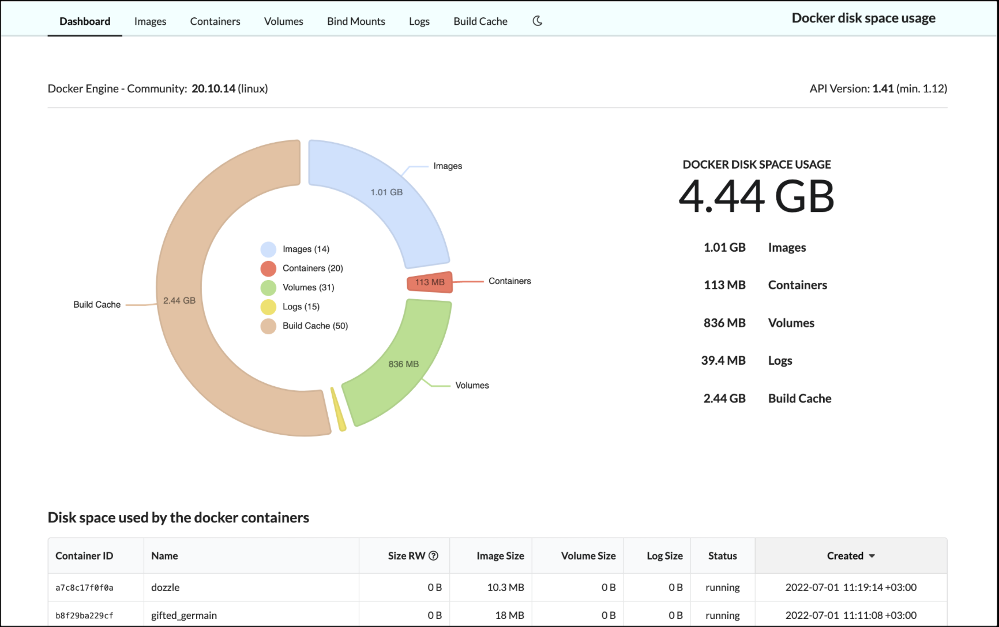

# Doku
Doku is a web-based Docker disk usage monitor.

<br>

- [Homepage](https://docker-disk.space)
- [Github repo](https://github.com/amerkurev/doku)




## docker-compose.yml
```yml
services:
  doku:
    image: amerkurev/doku
    container_name: doku
    ports:
      - 9090:9090
    volumes:
      - '/var/run/docker.sock:/var/run/docker.sock:ro'
      - '/:/hostroot:ro'
```
