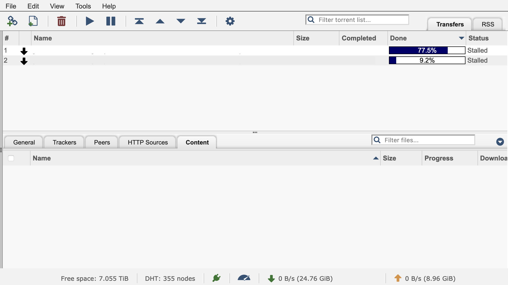
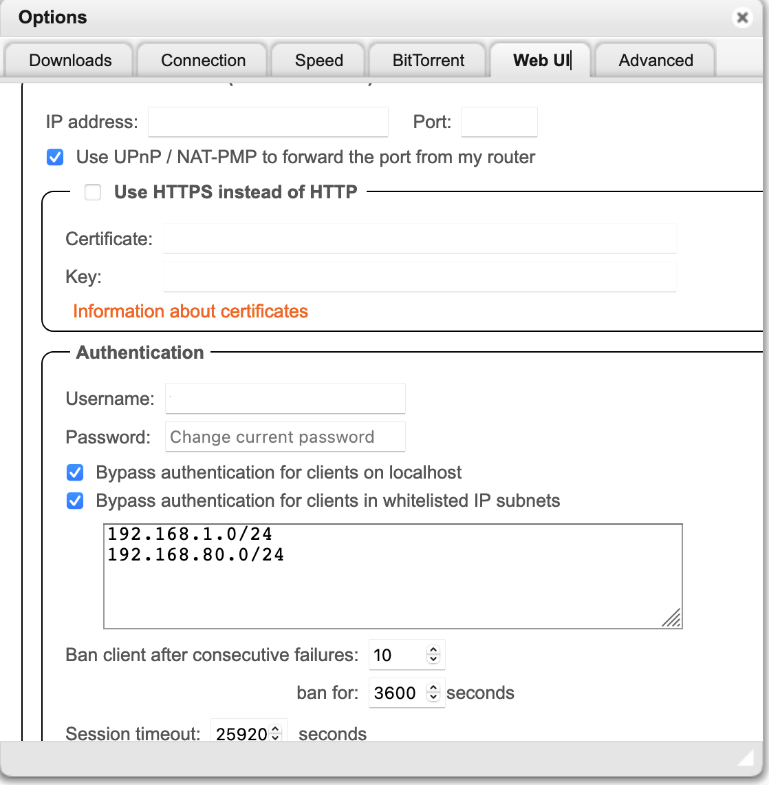

# qbittorrent
- ugly as hell
- probably the best (as of today)

<br>

- [Homepage](https://www.qbittorrent.org/)
- [Github repo](https://github.com/qbittorrent/qBittorrent)
- [DockerHub repo](https://hub.docker.com/r/linuxserver/qbittorrent)




## docker-compose.yml
```yml
---
version: "2.1"
services:
  qbittorrent:
    image: linuxserver/qbittorrent
    container_name: qbittorrent
    restart: unless-stopped
    environment:
      - PUID=1000
      - PGID=1000
      - TZ=Europe/Dublin
      - UMASK_SET=022
      - WEBUI_PORT=3030
    volumes:
      - ./config:/config
      - ./downloads:/downloads
    ports:
      - 6881:6881
      - 6881:6881/udp
      - 3030:3030

networks:
  default:
    ipam:
      driver: default
    config:   # set fixed subnet mask
      - subnet: 192.168.80.0/24
        gateway: 192.168.80.1
```


## Tips & Tricks

### Disabling the auth for webUI
- find the docker container IP, e.g. in /data/qbittorrent/logs
- in the settings, in WebUI/Authentication - enter the net mask, e.g.: `192.168.80.0/24`


