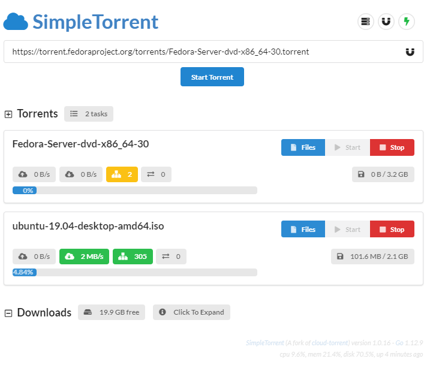

# SimpleTorrent (aka CloudTorrent)
- can work with no authentication
- nice web API
- good looking and functional
- there doesn't seem to be a way to integrate it with Sonarr/Radarr

<br>

- [Github repo](https://github.com/boypt/simple-torrent)




## docker-compose.yml
```yml
services:
  cloud-torrent:
    image: boypt/cloud-torrent
    container_name: cloud-torrent
    restart: unless-stopped
    environment:
      - TZ=Europe/Dublin
    ports:
      - "3123:3000"
    volumes:
      - ./downloads:/downloads
      # - /path/to/my/torrents:/torrents
```
