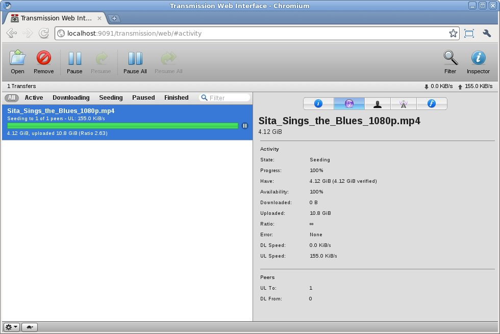

# Transmission
- doesn't have authentication
- with the `/transmission-web-control/` theme it's possible to add a script on download
- ugly as hell

<br>

- [Homepage](https://transmissionbt.com/)
- [Github repo](https://github.com/transmission/transmission)
- [DockerHub repo](https://hub.docker.com/r/linuxserver/transmission)




## docker-compose.yml
```yml
services:
  transmission:
    image: linuxserver/transmission
    container_name: transmission
    restart: unless-stopped
    environment:
      - PUID=1000
      - PGID=1000
      - TZ=Europe/Dublin
      - TRANSMISSION_WEB_HOME=/transmission-web-control/
#      - TRANSMISSION_WEB_HOME=/kettu/
    ports:
      - 3124:9091
      - 51413:51413
      - 51413:51413/udp
    volumes:
      - ./config:/config
      - ./downloads:/downloads
#      - <path to watch folder>:/watch
```
