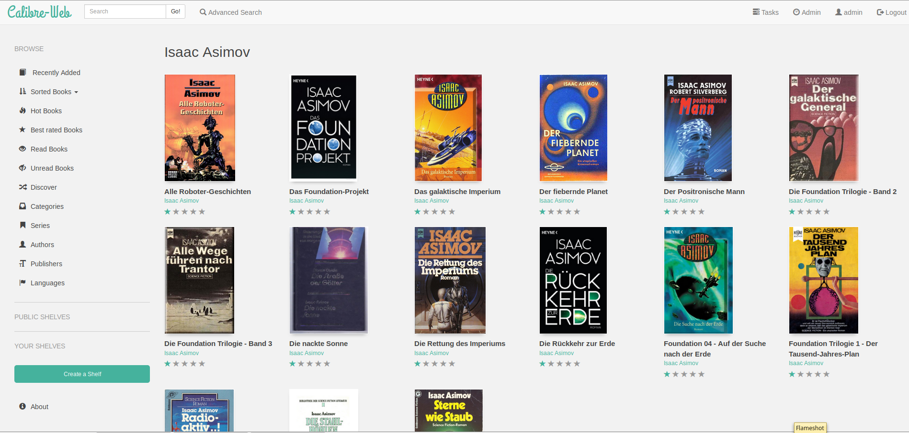

# Calibre

## calibre (server)
Basically a desktop calibre app with a web interface.
This will allow you to generate calibre library needed for the Calibre Web.

<br>

- [Homepage](https://calibre-ebook.com/)
- [Github repo]()
- [DockerHub repo](https://hub.docker.com/r/linuxserver/calibre)

### docker-compose.yml
```yml
---
version: "2"
services:
  calibre:
    image: linuxserver/calibre
    container_name: calibre
    restart: unless-stopped
    environment:
      - PUID=1000
      - PGID=1000
      - TZ=Europe/Dublin
    #   - GUAC_USER=user1 #optional
    #   - GUAC_PASS=password #optional
    volumes:
      - ./data:/config
      - /my-books:/books
    ports:
      - 3060:8080
      - 3061:8081
```


## calibre-web
A nice UI for reading books.
Connects to calibre server's database (server does not need to be running).

<br>

- [Github repo](https://github.com/janeczku/calibre-web)
- [DockerHub repo](https://hub.docker.com/r/linuxserver/calibre-web)



### docker-compose.yml
```yml
---
version: "2"
services:
  calibre-web:
    image: linuxserver/calibre-web
    container_name: calibre-web
    environment:
      - PUID=1000
      - PGID=1000
      - TZ=Europe/Dublin
    volumes:
      - ./data:/config
      - /my-books/calibre:/books  # same as above + "calibre" folder
    ports:
      - 8083:8083
    restart: unless-stopped
```
