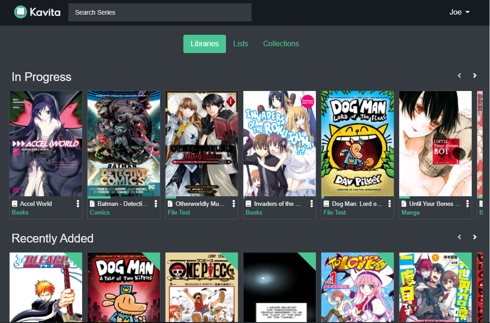

# Kavita

Probably the best self-hosted ebook & comic reader.

<br>

- [Homepage](http://www.kavitareader.com)
- [Github repo](https://github.com/Kareadita/Kavita)
- [Demo](https://demo.kavitareader.com) - login: demouser, pass: Demouser64




## docker-compose.yml
```yml
services:
  kavita:
    image: jvmilazz0/kavita:latest
    container_name: kavita
    restart: unless-stopped
    ports:
      - "5000:5000"
    volumes:
      - ./data:/kavita/config
      - ./books:/books
```
