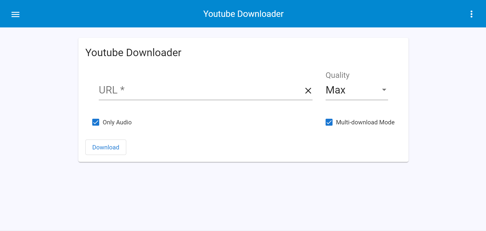

# Metube

- [Github repo](https://github.com/Tzahi12345/YoutubeDL-Material)



## docker-compose.yml
```yml
---

services:
  metube:
    image: alexta69/metube
    container_name: metube
    restart: unless-stopped
    user: "1001:1001"
    ports:
      - "8081:8081"
    volumes:
      - ./downloads:/downloads
```
