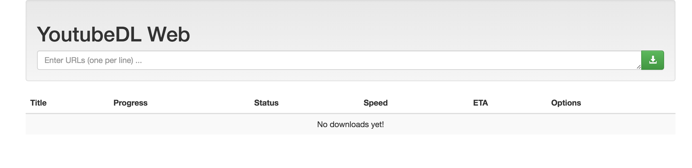

# YoutubeDL-web

- [Github repo](https://github.com/franhp/youtubedl-web)




## docker-compose.yml
```yml
services:
  youtubedl-web:
    image: franhp/youtubedl-web:latest
    container_name: youtubedl-web
    restart: unless-stopped
    ports:
      - "5000:5000"
    volumes:
      - ./downloads:/downloads
```
