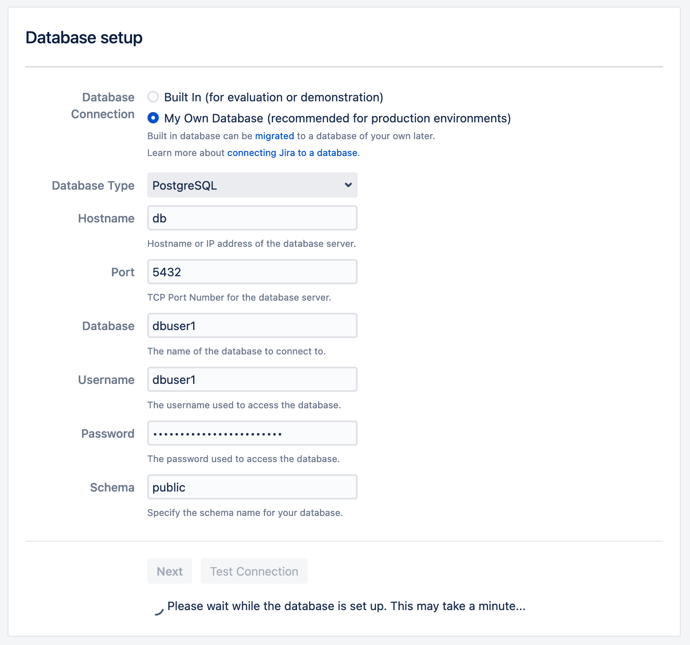

# Jira

- The most feature rich and complete solution with long history and wide support.
- The new (March 2021) pricing model makes it prohibitive for regular users.

<br>

- [Homepage](https://www.atlassian.com/software/jira/download)
- [DockerHub repo](https://hub.docker.com/r/atlassian/jira-software)


## docker-compose.yml
```yml
---
version: '3'
services:
  jira:
    image: atlassian/jira-software
    container_name: jira
    restart: unless-stopped
    environment:
      - TZ=Europe/Dublin
      - JVM_MINIMUM_MEMORY=4096m
      - JVM_MAXIMUM_MEMORY=8192m
      - ATL_PROXY_NAME=jira.example.com
      - ATL_PROXY_PORT=443
      - ATL_TOMCAT_SCHEME=https
      - ATL_TOMCAT_SECURE=true
      - ATL_AUTOLOGIN_COOKIE_AGE=2592000 # 30 days in seconds
    ports:
      - "8095:8080"
    volumes:
      - ./data:/var/atlassian/application-data/jira

  db:
    image: postgres
    restart: unless-stopped
    environment:
      - POSTGRES_USER=dbuser1
      - POSTGRES_PASSWORD=dbpass1
```

## Tips & Tricks

### First run DB setup:
It's better to user postgres, as the support is built-in.
MySQL requires additional drivers to be installed manually.


