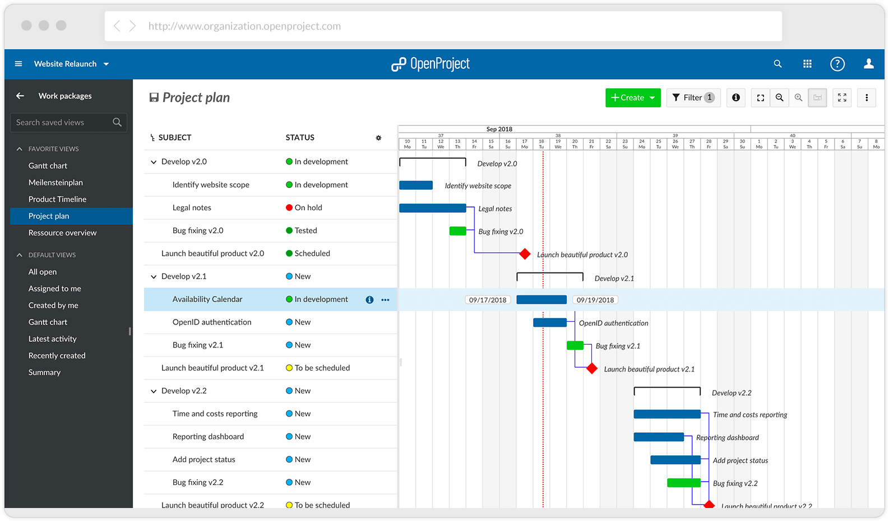

# Open Project
Full-featured & complicated.

<br>

- [Homepage](https://openproject.org/)
- [Github repo](https://github.com/opf/openproject)
- [Docs](https://docs.openproject.org/)




## docker-compose.yml
```yml
---
version: '3'
services:
  openproject:
    image: openproject/community
    container_name: openproject
    restart: unless-stopped
    environment:
      - SECRET_KEY_BASE=secret_key
    ports:
      - "3090:80"
    volumes:
      - ./pgdata:/var/openproject/pgdata
      - ./assets:/var/openproject/assets
```
